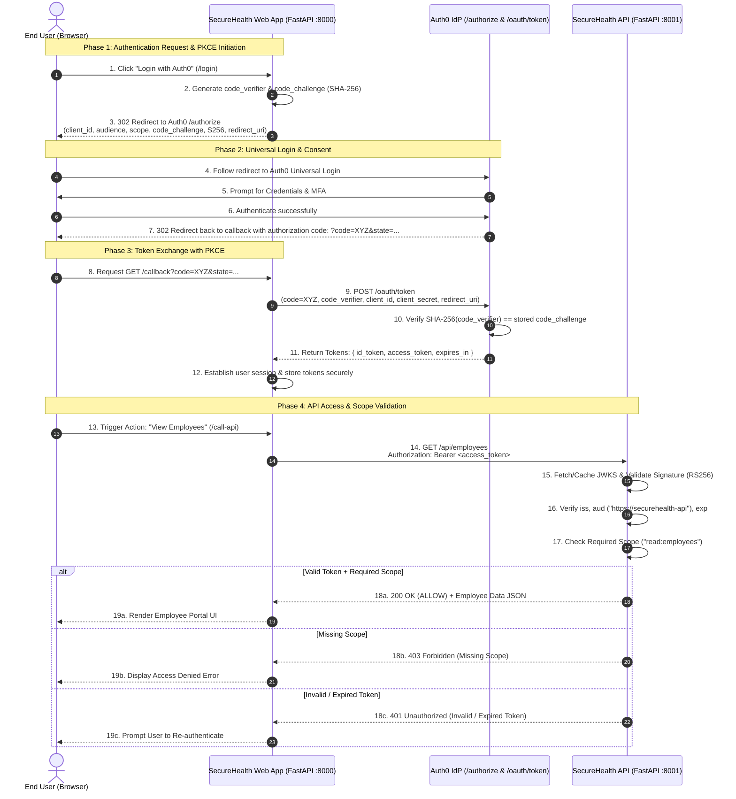

# Module 4 — OAuth 2.0, OIDC & JWT Security

## 1. Executive Summary & Objectives

Modern cloud architectures separate **User Authentication** (proving who a user is) from **API Authorization** (governing what resources a client application can access). 

In Module 4 of the SecureHealth IAM platform, we implement and demonstrate:
1. **OpenID Connect (OIDC)** authentication via Auth0 Universal Login using the **Authorization Code Flow with PKCE** (Proof Key for Code Exchange, RFC 7636).
2. **OAuth 2.0 Bearer JWT Authorization** against a protected FastAPI Resource Server (`SecureHealth Protected API`).
3. Cryptographic token validation using Auth0 JSON Web Key Sets (JWKS / RS256).
4. Deep claim-level separation between **ID Tokens** (for the client web app) and **Access Tokens** (for the backend API).
5. Comprehensive test suite exercising positive authorization (`200 OK / ALLOW`) and all negative security failure modes (`401 Unauthorized`, `403 Forbidden`).

---

## 2. End-to-End Protocol Flow Architecture

The following sequence diagram outlines the entire OIDC + OAuth 2.0 PKCE flow implemented across the SecureHealth Portal, Auth0 Identity Provider, and the Protected Health API:



---

## 3. Working Local Applications

The implementation consists of two decoupled FastAPI services:
1. **Client Web Application (`webapp/main.py`)**: Runs on port `8000`. Acts as the OAuth 2.0 Confidential Client / Relying Party implementing Universal Login, PKCE token exchange, token inspector UI, and API proxying.
2. **Protected Resource Server (`api/server.py`)**: Runs on port `8001`. Validates RS256 JWTs using Auth0's public JWKS endpoint and enforces departmental scopes.

### 3.1 Auth0 Configuration
- **Application Type**: Regular Web Application
- **Allowed Callback URLs**: `http://localhost:8000/callback`
- **Allowed Logout URLs**: `http://localhost:8000/`
- **API Identifier (Audience)**: `https://securehealth-api`
- **Scopes Defined**:
  - `read:employees` / `update:employees` (HR)
  - `read:transactions` (Finance)
  - `read:systems` (IT)
  - `read:reports` (Sales)

### 3.2 Starting the Applications

**Step 1: Start the Protected API Server (Port 8001)**
```powershell
.\.venv\Scripts\python -m uvicorn api.server:app --port 8001 --reload
```

**Step 2: Start the Web Application Portal (Port 8000)**
```powershell
.\.venv\Scripts\python -m uvicorn webapp.main:app --port 8000 --reload
```

**Step 3: Access the Portal**
- Navigate to `http://localhost:8000/`.
- Click **Log In with Auth0 Universal Login**.
- Authenticate with your test identity.
- Visit `/tokens` to view the **Token Inspector** comparing ID Token and Access Token.
- Visit `/call-api` to see the live call to `http://localhost:8001/api/employees` authorized with the Bearer Access Token.

---

## 4. Token Analysis: ID Token vs. Access Token

> [!IMPORTANT]
> **Golden Security Rule:** Never paste or commit real production tokens or credentials to Git repositories, Slack channels, or public issues. The samples below use synthetic, sanitized payloads generated locally for architectural study.

### 4.1 Comparison Overview

| Dimension | ID Token (OIDC) | Access Token (OAuth 2.0) |
|---|---|---|
| **Primary Purpose** | **Authentication** (proves identity to the client app) | **Authorization** (grants access to protected APIs) |
| **Intended Consumer** | **Client Application** (`webapp/main.py`) | **Resource Server / API** (`api/server.py`) |
| **Audience (`aud`)** | The Client Application's `client_id` | The API Identifier (e.g. `https://securehealth-api`) |
| **Contains User Profile?** | Yes (`name`, `email`, `sub`, `email_verified`) | Typically No (minimal claims: `sub`, `scope`, `permissions`) |
| **Accepted by API?** | **NO** (Must be rejected with 401/403) | **YES** (Validated for signature, audience, scopes) |
| **Format** | Must be a signed JWT (RFC 7519) | Can be a JWT or an opaque reference token |

### 4.2 Decoded Sample ID Token

```json
// Header
{
  "alg": "RS256",
  "typ": "JWT",
  "kid": "auth0-key-id-998"
}

// Payload
{
  "iss": "https://dev-ol7m540dysftaa5e.us.auth0.com/",
  "sub": "auth0|66fa81c00991427babcde123",
  "aud": "8eTORf9FzsolQcwrHqyjrGmjyL9QErRu",
  "iat": 1727000000,
  "exp": 1727036000,
  "name": "Dr. Sarah Mitchell",
  "nickname": "sarah.mitchell",
  "email": "sarah.mitchell@securehealth.org",
  "email_verified": true,
  "sid": "Vp_yW31cQnQ-example-session-id"
}
```

### 4.3 Decoded Sample Access Token

```json
// Header
{
  "alg": "RS256",
  "typ": "JWT",
  "kid": "auth0-key-id-998"
}

// Payload
{
  "iss": "https://dev-ol7m540dysftaa5e.us.auth0.com/",
  "sub": "auth0|66fa81c00991427babcde123",
  "aud": "https://securehealth-api",
  "iat": 1727000000,
  "exp": 1727003600,
  "scope": "openid profile email read:employees update:employees",
  "azp": "8eTORf9FzsolQcwrHqyjrGmjyL9QErRu",
  "gty": "authorization_code"
}
```

### 4.4 Token Claim Breakdown Table

| Claim | Full Name | Meaning & Security Check |
|---|---|---|
| `iss` | **Issuer** | The identity provider that minted and signed the token. The API must verify `iss == https://dev-ol7m540dysftaa5e.us.auth0.com/`. |
| `aud` | **Audience** | The intended recipient. For ID tokens, this is the application's Client ID. For Access tokens, this **must** match the API audience (`https://securehealth-api`). If `aud` does not match, the API rejects the request with `401 Unauthorized`. |
| `sub` | **Subject** | The unique, stable identifier representing the user (e.g. `auth0|66fa8...`). Used for database lookups and audit logging. |
| `exp` | **Expiration Time** | Unix epoch timestamp after which the token is invalid. Protects against stale or replayed tokens. |
| `iat` | **Issued At** | Timestamp when the token was created. |
| `scope` | **Scope** | Space-delimited list of delegated permissions (e.g., `read:employees`). The API checks whether the required scope is present before granting access. |
| `azp` | **Authorized Party** | The Client ID to which the token was issued during code exchange. |

---

## 5. Token Inspector CLI Utility

A dedicated command-line token inspector utility is available at `automation/decode_jwt.py`. It decodes headers and claims, provides human-readable timestamps, and explains security implications without transmitting tokens over the network:

```powershell
# Inspect synthetic ID and Access tokens:
.\.venv\Scripts\python automation/decode_jwt.py --sample

# Inspect an arbitrary JWT safely:
.\.venv\Scripts\python automation/decode_jwt.py --token "<raw_jwt_string>"
```

---

## 6. API Security Test Collection & Results

To fulfill **Task 6 and Task 7**, the test collection in `tests/test_module4_api.py` was executed against the SecureHealth Protected API. It verifies signature validation, issuer check, audience check, expiration check, and scope authorization.

### 6.1 Executing the Test Suite

```powershell
# Run formatted standalone report:
.\.venv\Scripts\python tests/test_module4_api.py

# Run via standard unittest runner:
.\.venv\Scripts\python tests/test_module4_api.py --unittest
```

### 6.2 Test Results Matrix

```
=====================================================================================
  MODULE 4 -- PROTECTED API JWT SECURITY & SCOPE TEST SUITE
=====================================================================================
Target API Audience: https://securehealth-api
Expected Issuer:     https://dev-ol7m540dysftaa5e.us.auth0.com/
-------------------------------------------------------------------------------------
#   | Test Scenario                  | Expected     | Actual       | Status
-------------------------------------------------------------------------------------
1   | Valid Token + Required Scope   | ALLOW        | HTTP 200     | PASS
2   | No Token Provided              | DENY (401)   | HTTP 401     | PASS
3   | Expired Token                  | DENY (401)   | HTTP 401     | PASS
4   | Wrong Audience                 | DENY (401)   | HTTP 401     | PASS
5   | Insufficient Scope             | DENY (403)   | HTTP 403     | PASS
6   | Wrong Issuer                   | DENY (401)   | HTTP 401     | PASS
7   | Tampered / Invalid Signature   | DENY (401)   | HTTP 401     | PASS
=====================================================================================
RESULT: ALL 7 TEST CASES PASSED SUCCESSFULLY.
=====================================================================================
```

### 6.3 Detailed Test Analysis

1. **Valid Token (`read:employees`)**: The API successfully verifies the signature against the public key, confirms `iss` and `aud`, verifies the token is unexpired, and checks that `read:employees` is in `scope`. Returns `200 OK` with employee data.
2. **No Token**: Request lacks the `Authorization: Bearer <token>` header. API returns `401 Unauthorized` (`Missing Authorization Bearer token`).
3. **Expired Token (`exp` in the past)**: PyJWT raises `jwt.ExpiredSignatureError`. API traps this and returns `401 Unauthorized` (`Token expired`).
4. **Wrong Audience (`aud="https://wrong-api"`)**: PyJWT raises `jwt.InvalidAudienceError`. API returns `401 Unauthorized` (`Invalid audience`). Prevents token misuse across services.
5. **Insufficient Scope (`scope="read:transactions"`)**: Token is authentic and valid, but the caller lacks the required `read:employees` scope. API returns `403 Forbidden` (`Missing scope 'read:employees'`).
6. **Wrong Issuer (`iss="https://rogue-tenant.auth0.com/"`)**: PyJWT raises `jwt.InvalidIssuerError`. API returns `401 Unauthorized` (`Invalid issuer`).
7. **Invalid / Tampered Signature**: Token signed by an untrusted RSA key. PyJWT raises `jwt.InvalidSignatureError`. API returns `401 Unauthorized` (`Invalid token signature`).

---

## 7. Troubleshooting & Common Pitfalls

| Issue | Symptom | Root Cause | Solution |
|---|---|---|---|
| **Opaque Access Token** | Access token is a short string (e.g. `d7s...`) instead of a 3-part JWT (`eyJ...`). | Auth0 did not receive an `audience` parameter in the `/authorize` request. | Specify `audience="https://securehealth-api"` in the authorization request (`client_kwargs` or `authorize_redirect`). |
| **Audience Mismatch** | API returns `401 Unauthorized: Invalid audience`. | The client requested a token without audience or with audience set to Auth0 Management API (`https://.../api/v2/`). | Ensure the web application requests `audience="https://securehealth-api"`. |
| **401 vs 403 Confusion** | API returns 401 when user lacks permission. | Failing to distinguish between authentication failure (401) and authorization failure (403). | Use 401 strictly for missing, expired, or cryptographically invalid tokens. Use 403 when the token is valid but lacks the required `scope`. |
| **PKCE `invalid_grant`** | Auth0 `/oauth/token` returns `invalid_grant: code_verifier does not match code_challenge`. | The session did not persist the `code_verifier` across redirects, or the browser session cookie was dropped. | Ensure `SessionMiddleware` is configured with `SameSite=lax` and valid secret key, and `AUTH0_CALLBACK_URL` matches exactly. |
| **Clock Skew Failures** | Valid tokens immediately fail with `Token expired` or `Immature token`. | Server time is unsynchronized with Auth0 time servers. | Configure NTP time synchronization or add a small clock skew leeway (e.g. `leeway=10` seconds in `jwt.decode`). |
| **Callback URL Mismatch** | Auth0 displays `Oops! Callback URL mismatch`. | The redirect URI sent in `/authorize` is not listed in the Application's Allowed Callback URLs in Auth0 dashboard. | Add `http://localhost:8000/callback` (or `http://localhost:8080/callback`) to Auth0 Application Settings -> Allowed Callback URLs. |
| **PAR Required Error** | `The usage of Pushed Authorization Requests is required by the configuration` | The application has "Require PAR" enabled in Auth0, blocking direct browser `/authorize` requests. | In Auth0 Dashboard -> Applications -> Your App -> Settings -> Authorization Requests, toggle **Require Pushed Authorization Requests (PAR)** to **OFF** and save. |

---

## 8. Interview Questions & Comprehensive Answers

### Question 1: OAuth 2.0 vs. OpenID Connect (OIDC)?
* **OAuth 2.0 (RFC 6749):** An **authorization framework** that allows a third-party application to obtain limited access to an HTTP resource on behalf of a resource owner. It issues **Access Tokens** but specifies nothing about the identity of the user who authorized the token. OAuth 2.0 answers: *"What is the client authorized to do?"*
* **OpenID Connect (OIDC):** An **identity layer built directly on top of OAuth 2.0**. It standardizes authentication by introducing the **ID Token** (a signed JSON Web Token), standard scopes (`openid`, `profile`, `email`), and the `/userinfo` endpoint. OIDC answers: *"Who is the user, and when did they authenticate?"*

### Question 2: ID Token vs. Access Token?
* **ID Token:** Designed exclusively for consumption by the **client application** (the Relying Party). Its audience (`aud`) is the client's `client_id`. It contains identity claims (`sub`, `name`, `email`, `auth_time`) used to establish a local user session and customize UI. **It must never be sent to an API.**
* **Access Token:** Designed exclusively for consumption by the **Resource Server (API)**. Its audience (`aud`) is the API Identifier (e.g. `https://securehealth-api`). It carries authorization data (such as `scope` and `permissions`) proving that the client has been delegated authority to perform operations on the API.

### Question 3: What is PKCE (Proof Key for Code Exchange) and why is it needed?
* **What it is (RFC 7636):** A security enhancement for the OAuth 2.0 Authorization Code Flow. The client generates a high-entropy cryptographically random secret (`code_verifier`), hashes it using SHA-256 (`code_challenge`), and sends the challenge in the initial `/authorize` request. When exchanging the authorization code at `/oauth/token`, the client sends the plain `code_verifier`. The authorization server hashes the verifier and ensures it matches the original challenge before issuing tokens.
* **Why it is needed:** In public clients (mobile apps, SPAs) or environments where the redirect URI can be intercepted (e.g., custom URI schemes, malicious local browser extensions, or network sniffing), an attacker could intercept the authorization code. Without PKCE, the attacker could exchange the stolen code for tokens. With PKCE, the authorization code is completely useless without the one-time `code_verifier` kept privately in the legitimate client's memory.

### Question 4: What are Issuer (`iss`) and Audience (`aud`)?
* **Issuer (`iss`):** A URL identifying the identity provider (IdP) that created and cryptographically signed the token (e.g., `https://dev-ol7m540dysftaa5e.us.auth0.com/`). The API verifies `iss` against its configured trusted IdP list to prevent tokens signed by a different or malicious tenant from being accepted.
* **Audience (`aud`):** The intended recipient of the token. For an access token, `aud` represents the target API resource identifier (e.g., `https://securehealth-api`). The API **must** reject tokens whose `aud` claim does not include its own identifier. This prevents **token reuse attacks**, where a token obtained for a low-security third-party API is replayed against a high-security API.

### Question 5: Why shouldn't an API accept an ID Token as an API Access Token?
1. **Audience Mismatch & Token Substitution:** An ID token's audience (`aud`) is set to the client application's `client_id`, not the API's identifier. If an API accepts ID tokens, any client application in the tenant can take the ID token it received and use it to call the API, bypassing authorization boundaries.
2. **Confused Deputy Attack:** A malicious client application could receive an ID token from a user logging in, and then send that user's ID token to a backend API to act on their behalf without the user ever granting permission to access that API.
3. **Absence of Authorization Metadata:** ID tokens represent authentication identity, not delegated permissions. They lack the OAuth `scope` or `permissions` claims required for the API to evaluate granular access control (e.g., `read:employees` vs `read:transactions`).
4. **Different Lifecycles and Caching:** ID tokens often have longer lifespans or are cached by the client session. Access tokens have shorter lifespans and specific revocation and renewal mechanisms tailored for resource protection.
